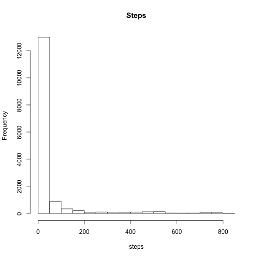
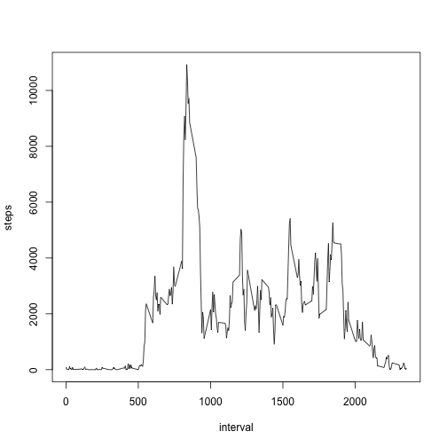
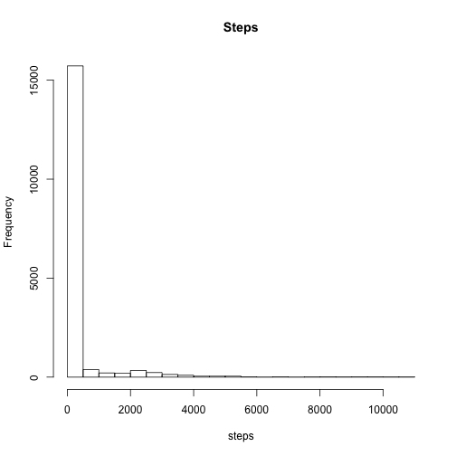
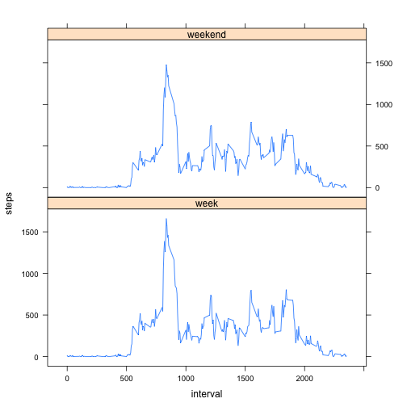

Title
========================================================

Histogram of steps per interval vs. frequency:

```r
library(lattice)
  setwd("/Users/rene_b23/desktop/coursera/Reproducable Research/RepData_PeerAssessment1")
  
   data<-as.data.frame(read.csv("./activity.csv", colClasses = c("numeric", "Date", "numeric")))

hist(data$steps, main="Steps",xlab="steps")
```

 


Mean and Median number of steps per day:

```r
agg<-aggregate(. ~ date, data=data, FUN=sum) 

mean(agg$steps)
```

```
## [1] 10766
```

```r
median(agg$steps) 
```

```
## [1] 10765
```


```r
a<-aggregate(. ~ interval, data=data, FUN=sum)
plot(a$interval, a$steps, xlab="interval",
     ylab="steps", type="l")
```

 

```r
a[which.max(a$steps), 1]
```

```
## [1] 835
```

Number of missing values:

```r
sum(is.na(data$steps))
```

```
## [1] 2304
```

Impute missing values by using averages for the time:

```r
for( i in 1:nrow(data)){
  if(is.na(data[i, 1])) data[i, 1]<-a[which(a$interval==data[i,3]),2]  
}
```

Histogram for new imputed data:

```r
hist(data$steps, main="Steps",xlab="steps")
```

 

Mean and Median for imputed data:

```r
agg<-aggregate(. ~ date, data=data, FUN=sum) 

mean(agg$steps)
```

```
## [1] 84188
```

```r
median(agg$steps) 
```

```
## [1] 11458
```
By imputing the steps it increases the mean and median


```r
data$day <- weekdays(data$date)
data$day<-as.character(data$day)

weekendData <- data[ which(data$day == "Saturday" | data$day == "Sunday"),]
weekendData<-weekendData[,c(1,3)]
weekendData<-aggregate(. ~ interval, data=weekendData, FUN=mean)
weekendData$day<-"weekend"

weekData <- data[ which(data$day == "Monday" | data$day == "Tuesday" | data$day == "Wednesday"| data$day == "Thursday"| data$day == "Friday"),]
weekData<-weekData[,c(1,3)]
weekData<-aggregate(. ~ interval, data=weekData, FUN=mean)
weekData$day<-"week"

allData<-rbind(weekendData, weekData)

xyplot(steps~interval| day ,data=allData, layout=c(1,2), type="l")
```

 
